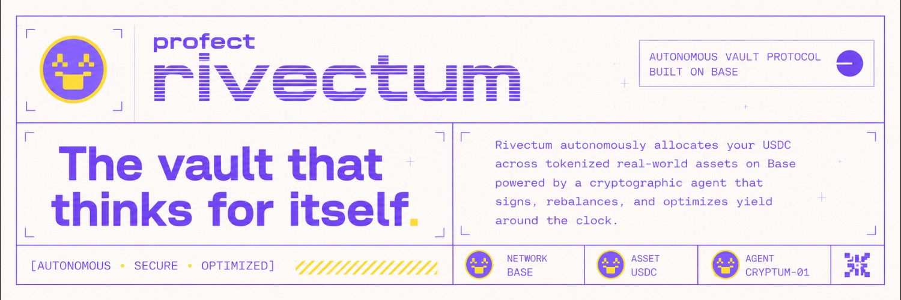

# RivectumRWA — Infrastructure



Infrastructure documentation for the RivectumRWA autonomous RWA allocation demo on Base Sepolia.

## Links

| Platform | URL |
|----------|-----|
| Website | [rivectum.xyz](https://rivectum.xyz/) |
| dApp | [app.rivectum.xyz](https://app.rivectum.xyz/) |
| X / Twitter | [@rivectum](https://rivectum.xyz/) |
| GitHub | [rivectumRWA](https://github.com/rivectumRWA/) |

## Contents

| File | Description |
|------|-------------|
| [ARCHITECTURE.md](./ARCHITECTURE.md) | System architecture, data flow, component interaction |
| [UI-APP.md](./UI-APP.md) | Dashboard UI overview — pages, components, routing |
| [BACKEND.md](./BACKEND.md) | Backend overview — smart contracts, agent, CLI |
| [DEPLOYMENT.md](./DEPLOYMENT.md) | VPS deployment, PM2 process management, Nginx reverse proxy |
| [ENVIRONMENT.md](./ENVIRONMENT.md) | Environment variables reference across all modules |

## Project Modules

```
project/
├── contracts/     Foundry + Solidity — ERC-4626 vault, deploy scripts, 10 tests
├── agent/         Bun + TypeScript — cron rebalance loop, SQLite decision log
├── web/           Next.js 15 dashboard — wagmi + Reown AppKit, deposit/withdraw
├── cli/           Bun + TypeScript — operator + user CLI for vault management
└── docs/          Design specs, architecture decisions, tutorial
```

## Stack Summary

| Layer | Technology |
|-------|-----------|
| Blockchain | Base Sepolia (Ethereum L2) |
| Smart Contracts | Solidity 0.8.24, Foundry, OpenZeppelin ERC-4626, Solady |
| Agent Runtime | Bun 1.3+, TypeScript, viem |
| Agent DB | SQLite via Drizzle ORM |
| Dashboard | Next.js 15 (App Router), React 18, Tailwind CSS 4 |
| Wallet Auth | Reown AppKit 1.7.19 + wagmi 2.15 |
| Charts | Recharts 3.8 |
| Server | PM2 + Nginx (VPS), Node.js 20 |
| CLI | Bun + TypeScript, viem |
